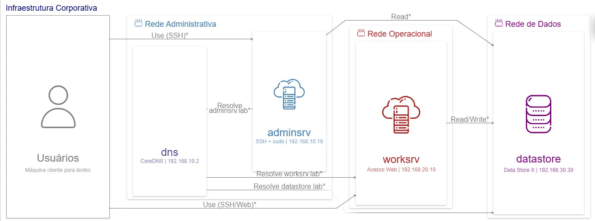
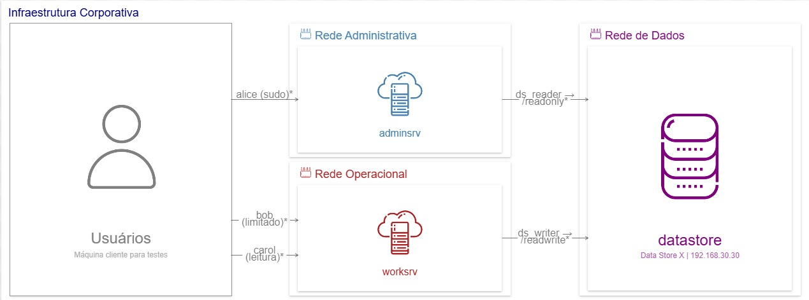

# Infraestrutura Automatizada com Containers e Ansible

**Instituto Federal de Mato Grosso — Campus Cuiabá**
Disciplina: Conteinerização e Orquestração

---

## Sumário

1. [Introdução](#introdução)
2. [Objetivos](#objetivos)
3. [Arquitetura da Infraestrutura](#arquitetura-da-infraestrutura)
4. [Mapeamento do Diagrama (Ilograph)](#mapeamento-do-diagrama-ilograph)
5. [Pré-requisitos](#pré-requisitos)
6. [Estrutura do Projeto](#estrutura-do-projeto)
7. [Como Executar](#como-executar)
8. [Configuração DNS (CoreDNS)](#configuração-dns-coredns)
9. [Automação com Ansible](#automação-com-ansible)
10. [Permissões e Controle de Acesso](#permissões-e-controle-de-acesso)
11. [Testes Automatizados](#testes-automatizados)
12. [Limitações Conhecidas](#limitações-conhecidas)
13. [Troubleshooting](#troubleshooting)

---

## Introdução

Este projeto consiste em uma infraestrutura corporativa simulada, totalmente automatizada e reproduzível por código (*Infrastructure as Code — IaC*), desenvolvida como trabalho da disciplina de Conteinerização e Orquestração. A infraestrutura é construída utilizando **Podman**, **Ansible** e **CoreDNS**, simulando uma empresa com dois segmentos de rede isolados — Administrativo e Operacional — além de um servidor de dados centralizado, com controle de acesso baseado em grupos de usuários.

Toda a configuração — criação de redes, provisionamento de containers, criação de usuários e grupos, atribuição de permissões e definição de diretórios compartilhados — é executada de forma automatizada por meio de um único script e de playbooks Ansible, sem necessidade de intervenção manual, permitindo que a infraestrutura seja recriada de forma idêntica em qualquer máquina.

Esta infraestrutura também serve de base para um segundo projeto, desenvolvido na disciplina de Lógica de Programação em Python ([`python-monitor`](https://github.com/RainerJustiniano/python-monitor)), que implementa um painel gráfico de monitoramento em tempo real dos containers aqui definidos — integrando o conteúdo de ambas as disciplinas.

**Tecnologias utilizadas:**

| Tecnologia | Versão | Função |
|---|---|---|
| Podman | 4.x+ | Criação e execução dos containers (sem precisar de Docker Desktop) |
| Ansible | 2.x+ | Automação de configuração (usuários, permissões, diretórios) |
| CoreDNS | 1.11.1 | Servidor DNS interno |
| Ubuntu | 22.04 | Sistema base dos containers |

> **Por que Podman?** No ambiente de desenvolvimento usado (Windows + WSL com pouco espaço em disco), o Podman foi escolhido por não exigir o Docker Desktop instalado.

## Objetivos

O desenvolvimento deste projeto teve como objetivo aplicar, de forma prática e integrada, os principais tópicos abordados na ementa da disciplina:

- Criação e orquestração de containers (Podman)
- Criação e isolamento de redes virtuais, com segmentação de tráfego entre setores
- Provisionamento de um serviço de resolução de nomes interno (DNS via CoreDNS)
- Automação de infraestrutura como código (*Infrastructure as Code*) utilizando Ansible
- Criação e gerenciamento de usuários, grupos e permissões de acesso
- Controle de acesso a diretórios compartilhados, incluindo listas de controle de acesso (ACL)
- Testes automatizados de validação de infraestrutura (rede, DNS, autenticação e permissões)

---

## Arquitetura da Infraestrutura
<br>
<br>

```
                        +-------------------+
                        |    DNS Server     |
                        |    dns.lab        |
                        | 10.2 | 20.2       |
                        +---+----------+----+
                            |          |
              admin_net     |          |    work_net
           192.168.10.0/24  |          | 192.168.20.0/24
                            |          |
     +----------+-----------+          +-----------+---------+
     |          |                                  |         |
+----+------+   +----------+          +------------+  +------+----+
| adminsrv  |   |  client  |          |   worksrv  |  |  client   |
| .10.10    |   |  .10.100 |          |   .20.10   |  |  .20.100  |
| SSH+sudo  |   | (testes) |          |  acesso web|  | (testes)  |
+----+------+   +----------+          +------+-----+  +------+----+
     |                                       |
     |         data_net 192.168.30.0/24      |
     |                                       |
     +----------------+----------------------+
                      |
               +------+-------+
               |  datastore   |
               |  .30.30      |
               | Data Store X |
               +--------------+

Legenda:
  adminsrv → datastore: LEITURA (Service A → Read)
  worksrv  → datastore: LEITURA e ESCRITA (Service B → Read/Write)
  client   → adminsrv: USO (Users → Service A)
  client   → worksrv:  USO (Users → Service B)
```

---

## Mapeamento do Diagrama (Ilograph)

O diagrama Ilograph fornecido foi mapeado para componentes reais de infraestrutura:

| Recurso Ilograph | Container | Função | Rede(s) |
|---|---|---|---|
| **Users** | `client` | Máquina cliente para testes | admin_net + work_net |
| **Service A** | `adminsrv` | Servidor Administrativo (SSH + sudo) | admin_net + data_net |
| **Service B** | `worksrv` | Servidor Operacional (web + restrito) | work_net + data_net |
| **Data Store X** | `datastore` | Servidor de Dados Corporativos | data_net |
| *(Infraestrutura)* | `dns` | Servidor DNS Interno (CoreDNS) | admin_net + work_net |

**Relações implementadas:**

- `Users → Service A` (Use): client acessa adminsrv via SSH na admin_net
- `Users → Service B` (Use): client acessa worksrv via SSH na work_net
- `Service A → Data Store X` (Read): adminsrv acessa /datastore/readonly via usuário de serviço `ds_reader`
- `Service B → Data Store X` (Read/Write): worksrv acessa /datastore/readwrite via usuário de serviço `ds_writer`

---

## Pré-requisitos

### No Windows com WSL Ubuntu

```bash
# 1. Instalar WSL Ubuntu (PowerShell como Administrador, no Windows)
wsl --install -d Ubuntu

# 2. Dentro do WSL Ubuntu, instalar Podman e dependências
sudo apt update
sudo apt install -y podman ansible sshpass git

# 3. Verificar instalação
podman --version
ansible --version
```

---

## Estrutura do Projeto

```
projeto-iac/
│
├── setup.sh                     # Script único: builda, sobe, configura e testa tudo (Podman)
├── teardown.sh                  # Para e remove todos os containers e redes
│
├── containers/
│   ├── base/
│   │   └── Dockerfile          # Imagem base Ubuntu 22.04 com SSH
│   └── dns/
│       ├── Dockerfile          # Imagem CoreDNS com configs
│       ├── Corefile            # Configuração principal do CoreDNS
│       └── hosts               # Mapeamento nome → IP interno
│
├── ansible/
│   ├── inventory               # Lista de hosts gerenciados
│   ├── playbook.yml            # Playbook principal de configuração
│   └── roles/
│       ├── users/              # Criação de grupos e usuários
│       │   ├── tasks/main.yml
│       │   ├── handlers/main.yml
│       │   └── vars/main.yml
│       ├── permissions/        # Sudo e controle de acesso
│       │   └── tasks/main.yml
│       └── directories/        # Diretórios corporativos + ACLs
│           └── tasks/main.yml
│
├── scripts/
│   └── test.sh                 # Bateria de testes automatizados
│
└── README.md                   # Esta documentação
```

---

## Como Executar

Um único comando builda as imagens, cria as redes, sobe os 5 containers, roda o Ansible e executa os testes:

```bash
git clone https://github.com/RainerJustiniano/projeto-iac.git
cd projeto-iac
bash setup.sh
```

Ao final você verá as credenciais de acesso SSH no terminal. Para refazer tudo do zero, basta rodar `bash setup.sh` novamente — o script remove containers e redes anteriores antes de recriar.

> **Por que não usar `podman-compose`?** A versão 1.0.6 do `podman-compose` tem um bug conhecido: ela aplica a flag `--ip` em **todas** as redes de um container simultaneamente, mesmo quando você só define IP fixo em uma rede. Isso quebra qualquer container conectado a mais de uma rede (erro `--ip can only be set for a single network`). O `setup.sh` contorna isso criando cada container com `podman run` e conectando as redes extras depois, via `podman network connect`.

### Rodando o Ansible manualmente (opcional, já incluso no setup.sh)

```bash
cd ansible/
ansible all -i inventory -m ping
ansible-playbook -i inventory playbook.yml
```

### Rodando os testes manualmente (opcional, já incluso no setup.sh)

```bash
cd scripts/
chmod +x test.sh
./test.sh
```

### Parando e removendo tudo

Quando terminar de usar a infraestrutura (ex.: depois da apresentação, ou pra liberar recursos da máquina), use o `teardown.sh` em vez de remover containers um por um manualmente:

```bash
bash teardown.sh
```

Isso para e remove os 5 containers e as 3 redes (`admin_net`, `work_net`, `data_net`). As imagens já buildadas (`projeto-iac/base`, `docker.io/coredns/coredns`) **não são removidas** — assim, rodar `bash setup.sh` de novo é rápido, sem precisar rebuildar do zero.

> Se quiser só **pausar** sem remover (pra religar depois sem rebuildar nada), use `podman stop dns adminsrv worksrv datastore client` e depois `podman start` nos mesmos nomes — mais rápido que remover e recriar.

---

## Configuração DNS (CoreDNS)

O **CoreDNS** foi escolhido por sua simplicidade: uma única configuração em texto (`Corefile`) substitui as múltiplas zonas e arquivos do BIND9.

### Como funciona

O arquivo `Corefile` define dois blocos de zona:

```
lab. { ... }   ← responde consultas para *.lab
. { ... }      ← redireciona o resto para 8.8.8.8
```

O plugin `hosts` funciona como um `/etc/hosts` centralizado para toda a rede:

```
192.168.10.10  adminsrv.lab
192.168.20.10  worksrv.lab
192.168.30.30  datastore.lab
192.168.10.2   dns.lab
```

> **Nota técnica:** a imagem oficial `docker.io/coredns/coredns` é construída `FROM scratch` (sem shell, sem `$PATH`) e o binário fica em `/coredns`. Por isso o `Dockerfile` em `containers/dns/` usa `ENTRYPOINT ["/coredns"]` com caminho absoluto — usar apenas `"coredns"` falha com `executable file not found in $PATH`.

### Testar manualmente

```bash
podman exec -it client bash

nslookup adminsrv.lab 192.168.10.2
nslookup worksrv.lab 192.168.10.2
nslookup datastore.lab 192.168.10.2

dig @192.168.10.2 adminsrv.lab
```

---

## Automação com Ansible

O Ansible automatiza **toda** a configuração dos servidores sem intervenção manual. Três roles compõem o playbook, executadas em ordem: `users` → `permissions` → `directories`.

### Role: users

Cria grupos e usuários com shells e senhas corretos.

| Usuário | Grupo | Shell | Função |
|---|---|---|---|
| `alice` | administradores | /bin/bash | Administradora — acesso total |
| `bob` | operadores | /bin/bash | Operador — acesso restrito |
| `carol` | convidados | /bin/rbash | Convidada — leitura apenas |

> O filtro `password_hash()` usado para gerar os hashes SHA-512 roda na **máquina de controle** (seu WSL), não no container remoto — é por isso que não há instalação de `passlib` dentro dos containers.

### Role: permissions

Configura o `/etc/sudoers.d/` por grupo:

| Grupo | Permissão Sudo |
|---|---|
| administradores | `ALL=(ALL:ALL) NOPASSWD: ALL` |
| operadores | Apenas `/operacao/scripts/*.sh` |
| convidados | Nenhuma |

Também cria, somente no container `datastore`, os usuários de serviço `ds_reader` (grupo operadores) e `ds_writer` (grupo administradores), que representam o Service A e o Service B do diagrama acessando o Data Store X.

### Role: directories

Cria a estrutura de diretórios corporativos com ACLs:

| Diretório | Dono | Grupo | Modo | Descrição |
|---|---|---|---|---|
| `/admin` | root | administradores | `0770` | Somente admins |
| `/operacao` | root | administradores | `0750` + ACL | Admins + Operadores |
| `/publico` | root | root | `1777` | Todos (sticky bit) |
| `/datastore/readonly` | root | operadores | `0750` + ACL | Leitura — `ds_reader` |
| `/datastore/readwrite` | root | administradores | `0770` + ACL | Escrita — `ds_writer` |

---

## Permissões e Controle de Acesso

### Tabela de Permissões por Diretório

```
Diretório        alice(admin)  bob(operador)  carol(convidado)
/admin           rwx           ---            ---
/operacao        rwx           r-x            ---
/publico         rwx           rwx            rwx
/datastore/*     via serviço   via serviço    sem acesso
```

### Sudo

```
alice@adminsrv:~$ sudo whoami                       → root  (permitido)
bob@worksrv:~$ sudo whoami                          → erro  (negado)
bob@worksrv:~$ sudo /operacao/scripts/status.sh      → OK   (permitido)
```

---

## Testes Automatizados

O `scripts/test.sh` valida 6 blocos: containers ativos, conectividade/isolamento de rede, resolução DNS, SSH e autenticação, permissões de diretório e os usuários de serviço do Data Store X (`ds_reader`/`ds_writer`).

```bash
cd scripts/
./test.sh
```

Resultado esperado: **24 de 26 testes passam**. Os 2 que falham são esperados e bem documentados — veja a seção [Limitações Conhecidas](#limitações-conhecidas).

---

## Limitações Conhecidas

### Isolamento ICMP entre redes não autorizadas

Para que o `ping` funcionasse entre redes **autorizadas** (ex.: client → adminsrv), foi necessário adicionar a capability `--cap-add NET_RAW` aos containers no Podman rootless. Essa capability também permite ICMP entre redes que deveriam estar isoladas (ex.: client → datastore, adminsrv → worksrv), fazendo 2 dos 26 testes do `test.sh` falharem.

**O isolamento real de dados (TCP/UDP) continua funcionando.** Apenas o protocolo ICMP (usado pelo `ping`) é afetado — ou seja, é possível "ouvir" a outra rede responder a um ping, mas não estabelecer conexões de aplicação reais através dela.

### Por que isso não foi corrigido com firewall (investigação documentada)

Tentamos corrigir isso de duas formas diferentes, e ambas revelaram limitações reais e específicas do Podman **rootless** rodando em **WSL2** — vale a pena documentar, porque mostra exatamente onde a abstração de containers sem privilégios encontra seus limites:

**Tentativa 1 — Bloquear no host, via `iptables` na chain `FORWARD`:**

A teoria: todo tráfego entre redes diferentes do Podman passa pelo roteamento do host, então bloquear ali deveria bastar. Na prática, **não funcionou**: inserimos regras `DROP` no topo da chain `FORWARD` e confirmamos, com `iptables -L FORWARD -n -v`, que o contador de pacotes permanecia em **0** mesmo enquanto o `ping` continuava passando normalmente. Isso indica que o WSL2 entrega esse tráfego por um caminho de rede próprio (provavelmente sua camada de virtualização de rede baseada em Hyper-V), que não passa pelo caminho padrão de roteamento do kernel Linux onde o `iptables` do host atua.

**Tentativa 2 — Bloquear dentro do próprio container, via `iptables` na chain `OUTPUT`:**

Se o host não intercepta o tráfego, a alternativa é bloquear *antes* de ele saber do container, usando a capability `NET_ADMIN`. Também **não funcionou** — mas por um motivo diferente e ainda mais fundamental:

```
$ podman exec client iptables -L OUTPUT -n -v
iptables v1.8.7 (nf_tables): Could not fetch rule set generation id: Permission denied (you must be root)

$ podman exec client cat /proc/self/uid_map
         0       1000          1
         1     100000      65536
```

O `uid_map` revela o motivo: dentro do container, `UID 0` (root) é apenas um **mapeamento de namespace** para o `UID 1000` real do usuário no host (você mesmo, sem privilégios elevados) — não é root de verdade. O subsistema `nftables`/`iptables-nft` do kernel exige privilégio genuíno do host para alterar regras de firewall, e isso é, por definição, exatamente o que o Podman **rootless** evita conceder — é uma característica de segurança, não um bug.

**Conclusão:** uma correção real exigiria rodar o Podman em modo **rootful** (com privilégio de root genuíno), uma mudança de arquitetura mais ampla que foge do escopo deste projeto. Em um ambiente de produção real (ou com Docker/Podman rootful), isso seria resolvido com regras de firewall no host sem nenhuma das limitações acima.

---

## Troubleshooting

### Podman não encontrado no WSL

```bash
sudo apt update
sudo apt install -y podman
```

### Ansible falha com "to use the 'ssh' connection type... you must install the sshpass program"

```bash
sudo apt install -y sshpass
```

### Ansible falha com "connection refused"

```bash
# Verificar se os containers estão de pé
podman ps

# Verificar se as portas estão abertas
ss -tlnp | grep -E "2210|2220|2230|2240"

# Aguardar containers iniciarem completamente antes do Ansible
sleep 8 && ansible all -i ansible/inventory -m ping
```

### Erro de autenticação SSH (senha não aceita)

Confirme que está digitando exatamente `Alice@2024!` (A maiúsculo, arroba, exclamação) — teclados em PT-BR às vezes trocam esses caracteres especiais. Teste sem digitar manualmente:

```bash
sshpass -p "Alice@2024!" ssh -o StrictHostKeyChecking=no -p 2210 alice@localhost "whoami"
```

### Erro "executable file 'coredns' not found in \$PATH"

Esse erro ocorre se você reconstruir a imagem DNS a partir do `Dockerfile` antigo. A versão atual já está corrigida (`ENTRYPOINT ["/coredns"]`, caminho absoluto). Se aparecer, confirme que está usando a versão mais recente do repositório (`git pull`).

### Erro `short-name "coredns/coredns:1.11.1" did not resolve to an alias`

```
Error: short-name "coredns/coredns:1.11.1" did not resolve to an alias and no
unqualified-search registries are defined in "/etc/containers/registries.conf"
```

Esse erro acontece quando a máquina não tem um registro padrão configurado (`/etc/containers/registries.conf`) — comum em instalações novas do Podman, varia de máquina para máquina. O `setup.sh` já usa o nome completo (`docker.io/coredns/coredns:1.11.1`) para evitar esse problema. Se você ainda assim encontrar esse erro:

```bash
# Confirme que está usando a versão mais recente do script
git pull
bash teardown.sh
bash setup.sh
```

Se persistir, configure o registro padrão manualmente:

```bash
echo 'unqualified-search-registries = ["docker.io"]' | sudo tee -a /etc/containers/registries.conf
```

### Já tenho a pasta `projeto-iac` mas o `git clone` falha com "already exists"

Se você (ou seu professor/colega) já clonou o repositório antes e quer atualizar para a versão mais recente, não precisa clonar de novo — basta atualizar:

```bash
cd ~/projeto-iac
git pull
bash setup.sh
```

Se preferir começar do zero (ex.: a pasta está com alterações locais bagunçadas):

```bash
rm -rf ~/projeto-iac
git clone https://github.com/RainerJustiniano/projeto-iac.git
cd projeto-iac
bash setup.sh
```

### Parar e limpar o ambiente (Podman)

```bash
bash teardown.sh
```

Veja mais detalhes na seção [Parando e removendo tudo](#parando-e-removendo-tudo).

### Refazer tudo do zero

```bash
bash setup.sh
```

---

*Projeto desenvolvido para a disciplina de Conteinerização e Orquestração — IFMT Campus Cuiabá*
